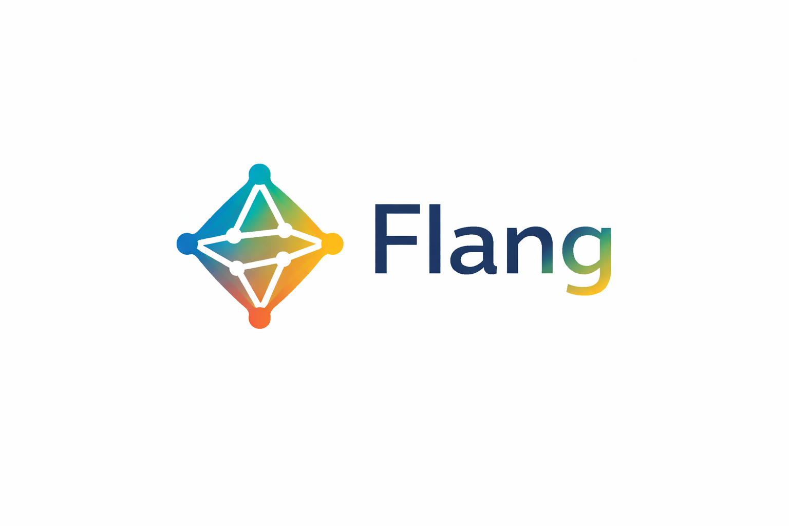

<p align="center">
  
</p>

<p align="center">
  <strong>A linguagem de programacao que transforma ideias em aplicacoes completas.</strong>
</p>

<p align="center">
  
  
  
  
  
</p>

<p align="center">
  <a href="#instalacao">Instalacao</a> ·
  <a href="#quick-start">Quick Start</a> ·
  <a href="#hello-world">Hello World</a> ·
  <a href="#estrutura-do-repositorio">Repositorio</a> ·
  <a href="docs/TUTORIAL.md">Tutorial</a> ·
  <a href="docs/SPEC.md">Especificacao</a> ·
  <a href="docs/API.md">API</a> ·
  <a href="docs/EXAMPLES.md">Exemplos</a> ·
  <a href="docs/FAQ.md">FAQ</a>
</p>

---

## O que e o Flang?

**Flang** e uma linguagem de programacao **completa, bilingue e declarativa** que gera aplicacoes full-stack a partir de arquivos `.fg`. A extensao oficial da linguagem e **`.fg`**, e este repositorio contem compilador, runtime, documentacao, extensao de editor e programas de exemplo.

```
sistema loja

dados
  produto
    nome: texto obrigatorio
    preco: dinheiro
    status: status

telas
  tela produtos
    titulo "Produtos"
    lista produto
      mostrar nome
      mostrar preco
      mostrar status
    botao azul
      texto "Novo Produto"

eventos
  quando clicar "Novo Produto"
    criar produto

logica
  funcao aplicar_desconto(preco, percentual)
    retornar preco - (preco * percentual / 100)

  se produto.preco maior 100
    mostrar "Produto premium"
```

```bash
flang run inicio.fg
# App completa rodando em http://localhost:8080
```

---

## Hello World

Exemplo minimo de sintaxe em Flang:

```fg
logica

definir nome = "Flang"

mostrar "Olá " + nome
```

Arquivo sugerido: [examples/hello-world.fg](examples/hello-world.fg)

---

## Por que Flang?

| Problema | Flang |
|----------|-------|
| Semanas para um CRUD | **Segundos** |
| Backend + Frontend + DB separados | **1 arquivo .fg** |
| Aprender React + Node + SQL | **Aprenda Flang em 5 min** |
| API REST manual | **Automatica com paginacao, filtros, busca** |
| WebSocket complexo | **Embutido e automatico** |
| WhatsApp/Email trabalhoso | **3 linhas no .fg** |
| Portugues ou English? | **Os dois. Misture livremente** |
| Sem logica de programacao | **Variaveis, funcoes, loops, if/else** |

---

## Features

### Linguagem Completa
- **Bilingue** — Portugues e English, misture livremente
- **Variaveis** — `definir x = 10` / `set x = 10`
- **Funcoes** — `funcao soma(a, b)` / `function sum(a, b)`
- **Condicionais** — `se/senao` / `if/else` com `senao se` / `else if`
- **Loops** — `repetir N vezes`, `enquanto`, `para cada`
- **Controle** — `parar` (break), `continuar` (continue), `retornar` (return)
- **Erros** — `tentar/erro` (try/catch)
- **16 operadores** — `+ - * / == != > < >= <= e ou nao`
- **16 funcoes built-in** — texto, numero, tamanho, maiusculo, minusculo, arredondar, aleatorio, agora, contem, dividir, juntar, abs, min, max, inteiro, tipo

### Full-Stack Automatico
- **Backend** — Servidor HTTP embutido com API REST
- **Frontend** — Dashboard moderno com glassmorphism, dark mode, sidebar
- **Banco de Dados** — SQLite, MySQL, PostgreSQL
- **WebSocket** — Tempo real entre multiplos usuarios
- **Upload** — Arquivos salvos em disco com preview
- **Paginacao** — `?pagina=1&limite=10&busca=texto&ordenar=preco`
- **Export** — CSV e JSON com um clique

### Seguranca
- **Auth** — Login, registro, JWT, bcrypt, roles
- **Validacao** — obrigatorio, unico, email, telefone
- **XSS/SQL Injection** — Protecao automatica
- **Headers** — X-Content-Type-Options, X-Frame-Options, CSP

### Integracoes
- **WhatsApp** — Mensagens automaticas via whatsmeow
- **Email** — SMTP com templates
- **Cron** — Agendamentos (`cada 5 minutos`)
- **HTTP Client** — Chamar APIs externas
- **Webhooks** — Receber notificacoes

### DevOps
- **Docker** — Dockerfile + docker-compose
- **VS Code** — Syntax highlighting extension
- **CI/CD** — GitHub Actions
- **Instalador** — .exe para Windows, .sh para Linux/macOS

---

## Instalacao

### Windows

Baixe e execute o instalador:

```
FlangSetup-0.4.0.exe
```

Instala em `C:\Flang`, adiciona ao PATH automaticamente.

### Linux / macOS

```bash
curl -fsSL https://github.com/flaviokalleu/flang/releases/latest/download/install.sh | sh
```

### Build do Fonte

```bash
git clone https://github.com/flaviokalleu/flang.git
cd flang
go build -o flang .
```

---

## Quick Start

### 1. Criar projeto

```bash
flang new meu-app
```

### 2. Rodar

```bash
cd meu-app
flang run inicio.fg
```

### 3. Abrir

```
http://localhost:8080
```

---

## Estrutura do Repositorio

Este repositorio foi organizado para parecer e funcionar como um projeto real de linguagem de programacao:

| Caminho | Papel |
|---------|-------|
| `compiler/` | Lexer, parser e AST da linguagem |
| `runtime/` | Interpretador, servidor HTTP, banco, auth e integracoes |
| `examples/` | Programas de exemplo em `.fg` |
| `demo/` | Aplicacoes maiores para validar o runtime |
| `docs/` | Especificacao, tutorial, API e referencia |
| `vscode-flang/` | Syntax highlighting e suporte de editor |
| `.gitattributes` | Associa `*.fg` a linguagem Flang no GitHub |

Os exemplos iniciais incluidos neste repositorio sao:

- [examples/hello-world.fg](examples/hello-world.fg)
- [examples/cadastro-simples.fg](examples/cadastro-simples.fg)
- [examples/english-mode.fg](examples/english-mode.fg)

---

## Exemplos

Para exemplos pequenos e diretos, comece pela pasta [examples/](examples/). Para aplicacoes mais completas, veja [demo/](demo/) e [docs/EXAMPLES.md](docs/EXAMPLES.md).

### Portugues

```
sistema restaurante

dados
  prato
    nome: texto obrigatorio
    preco: dinheiro
    status: status

telas
  tela cardapio
    titulo "Cardapio"
    lista prato
      mostrar nome
      mostrar preco
      mostrar status
    botao azul
      texto "Novo Prato"

eventos
  quando clicar "Novo Prato"
    criar prato
```

### English

```
system store

models
  product
    name: text required
    price: money
    status: status

screens
  screen products
    title "Products"
    list product
      show name
      show price
      show status
    button blue
      text "New Product"

events
  when click "New Product"
    create product
```

### Com Logica

```
logica

  definir taxa_imposto = 0.15

  funcao calcular_total(preco, quantidade)
    definir subtotal = preco * quantidade
    definir imposto = subtotal * taxa_imposto
    retornar subtotal + imposto

  repetir 10 vezes
    mostrar "processando..."

  enquanto estoque menor 5
    mostrar "estoque critico!"
    parar

  se pedido.valor maior 200
    definir pedido.frete = 0
    mostrar "Frete gratis!"
  senao
    definir pedido.frete = 15.90
```

### Com Auth

```
autenticacao
  modelo: usuario
  campo_login: email
  campo_senha: senha
  roles: admin, vendedor, cliente
```

### Com WhatsApp + Email

```
integracoes
  whatsapp
    quando criar pedido
      enviar mensagem para telefone
        texto "Pedido recebido! {prato} x{quantidade}"

  email
    servidor: "smtp.gmail.com"
    porta: "587"
    quando criar pedido
      enviar email para cliente.email
        assunto "Pedido confirmado"
        texto "Ola {cliente}, seu pedido foi confirmado!"
```

### Com Banco de Dados

```
banco
  driver: postgres
  host: "localhost"
  porta: "5432"
  nome: "minha_loja"
  usuario: "postgres"
  senha: "minhasenha"
```

### Projeto Modular

```
sistema restaurante

importar "tema.fg"
importar "dados.fg"
importar "telas.fg"
importar "eventos.fg"
importar "regras.fg"
```

---

## Tipos de Dados

| Tipo PT | Tipo EN | Descricao | Input HTML |
|---------|---------|-----------|------------|
| `texto` | `text` | Texto simples | text |
| `texto_longo` | `long_text` | Texto longo | textarea |
| `numero` | `number` | Numero | number |
| `dinheiro` | `money` | Valor R$ | number |
| `email` | `email` | Com validacao | email |
| `telefone` | `phone` | Com validacao | tel |
| `status` | `status` | Badge colorido | text |
| `data` | `date` | Data | date |
| `booleano` | `boolean` | Sim/Nao | checkbox |
| `senha` | `password` | Mascarado + bcrypt | password |
| `imagem` | `image` | Upload | file |
| `arquivo` | `file` | Upload | file |
| `link` | `link` | URL | url |

## Modificadores

| PT | EN | Efeito |
|----|----|--------|
| `obrigatorio` | `required` | NOT NULL + validacao |
| `unico` | `unique` | UNIQUE constraint |
| `pertence_a` | `belongs_to` | Foreign key |
| `indice` | `index` | CREATE INDEX |
| `soft_delete` | `soft_delete` | Exclusao logica |

## Status Badges

Campos `status` ganham badges automaticos:

| Cor | Valores |
|-----|---------|
| Verde | ativo, livre, pronto, entregue, pago, aprovado |
| Amarelo | pendente, aguardando, preparando, reservado |
| Vermelho | inativo, ocupado, cancelado, bloqueado |
| Azul | outros |

---

## API REST

Cada modelo gera automaticamente:

| Metodo | Rota | Acao |
|--------|------|------|
| `GET` | `/api/{modelo}` | Listar (com paginacao, filtros, busca) |
| `GET` | `/api/{modelo}/{id}` | Buscar por ID |
| `POST` | `/api/{modelo}` | Criar |
| `PUT` | `/api/{modelo}/{id}` | Atualizar |
| `DELETE` | `/api/{modelo}/{id}` | Deletar (ou soft delete) |

### Query Parameters

```
?pagina=1&limite=10          # Paginacao
?busca=texto                 # Busca full-text
?status=ativo                # Filtro por campo
?ordenar=preco&ordem=ASC     # Ordenacao
```

### Endpoints Especiais

| Rota | Descricao |
|------|-----------|
| `/api/login` | Login (JWT) |
| `/api/registro` | Registro |
| `/api/me` | Usuario atual |
| `/api/_stats` | Estatisticas |
| `/api/_eval` | Executar codigo Flang |
| `/api/_log` | Logs do mostrar/print |
| `/api/{modelo}/export/csv` | Exportar CSV |
| `/api/{modelo}/export/json` | Exportar JSON |
| `/upload` | Upload de arquivos |
| `/health` | Health check |
| `/ws` | WebSocket |

---

## CLI

| Comando | Descricao |
|---------|-----------|
| `flang run arquivo.fg` | Executa |
| `flang arquivo.fg` | Atalho para run |
| `flang check arquivo.fg` | Verifica sintaxe |
| `flang new nome` | Novo projeto |
| `flang init nome` | Projeto com .env, Docker |
| `flang docker` | Gera Dockerfile |
| `flang version` | Versao |
| `flang help` | Ajuda |

---

## Arquitetura

```
arquivo.fg
    |
    v
 [Lexer] ──> tokens (150+ keywords PT/EN)
    |
    v
 [Parser] ──> AST
    |
    v
 [Runtime]
    |── [Interpreter]  Variaveis, funcoes, loops, if/else
    |── [Banco]        SQLite / MySQL / PostgreSQL
    |── [Servidor]     HTTP + WebSocket + REST API
    |── [Renderer]     HTML/CSS/JS dinamico (glassmorphism, dark mode)
    |── [Auth]         JWT + bcrypt + roles
    |── [WhatsApp]     whatsmeow
    |── [Email]        SMTP
    |── [Cron]         Agendamentos
    └── [HTTP Client]  APIs externas
```

```
flang/
├── main.go
├── cli/                     # CLI
├── compiler/
│   ├── lexer/               # Tokenizador bilingue
│   ├── parser/              # Parser -> AST
│   └── ast/                 # AST nodes
├── runtime/
│   ├── interpreter/         # Motor de scripting
│   ├── auth/                # JWT + bcrypt
│   ├── banco/               # SQLite, MySQL, PostgreSQL
│   ├── servidor/            # HTTP + WebSocket + Renderer
│   ├── whatsapp/            # WhatsApp
│   ├── email/               # SMTP
│   ├── cron/                # Agendamentos
│   └── httpclient/          # HTTP client
├── installer/               # Windows .exe + Linux .sh
├── vscode-flang/            # VS Code extension
├── docs/                    # Documentacao completa
├── examples/                # Programas pequenos e introdutorios
└── demo/                    # Aplicacoes maiores e modulares
```

---

## Documentacao

| Documento | Descricao |
|-----------|-----------|
| [Tutorial](docs/TUTORIAL.md) | Aprenda Flang do zero (16 capitulos) |
| [Especificacao](docs/SPEC.md) | Gramática formal, todos os keywords |
| [API Reference](docs/API.md) | Todos os endpoints REST |
| [Seguranca](docs/SECURITY.md) | Auth, JWT, XSS, SQL injection |
| [Integracoes](docs/INTEGRATIONS.md) | WhatsApp, Email, Cron |
| [Deploy](docs/DEPLOY.md) | Docker, Nginx, PostgreSQL, systemd |
| [Exemplos](docs/EXAMPLES.md) | 10 projetos completos |
| [Cheatsheet](docs/CHEATSHEET.md) | Referencia rapida |
| [FAQ](docs/FAQ.md) | 34 perguntas frequentes |
| [Changelog](docs/CHANGELOG.md) | Historico de versoes |

---

## Comparacao

| | Flang | Low-Code | Manual |
|-|-------|----------|--------|
| Tempo CRUD | Segundos | Minutos | Dias |
| Backend + Frontend | 1 arquivo | Parcial | Separado |
| Logica real | Sim | Limitado | Sim |
| 3 bancos de dados | Sim | Depende | Manual |
| WebSocket | Automatico | Plugin | Manual |
| WhatsApp | 3 linhas | Nao | Complexo |
| Auth JWT | 4 linhas | Config | Manual |
| Export CSV | Automatico | Depende | Manual |
| Bilingue PT/EN | Sim | Nao | Nao |
| Open source | MIT | Nem sempre | - |
| Self-hosted | Sim | Depende | Sim |

---

## Roadmap

- [ ] Graficos/Charts interativos
- [ ] OAuth2 (Google, GitHub login)
- [ ] Pagamentos (Stripe, MercadoPago, PIX)
- [ ] Editor visual para .fg
- [ ] Flang Cloud (deploy 1 comando)
- [ ] Mais integracoes (Telegram, SMS, Slack)
- [ ] PWA (Progressive Web App)
- [ ] GraphQL
- [ ] Flang escrito em Flang

---

## Contribuir

```bash
git clone https://github.com/flaviokalleu/flang.git
cd flang
CGO_ENABLED=0 go build -o flang .
./flang run examples/cadastro-simples.fg
```

1. Fork
2. Branch (`git checkout -b feature/nova-feature`)
3. Commit (`git commit -m 'Add: nova feature'`)
4. Push (`git push origin feature/nova-feature`)
5. Pull Request

---

## Licenca

MIT License — veja [LICENSE](LICENSE)

---

<p align="center">
  
  <br>
  <strong>Flang</strong> — Descreva. Programe. Execute.
  <br>
  <sub>Feito por <a href="https://github.com/flaviokalleu">@flaviokalleu</a></sub>
</p>
